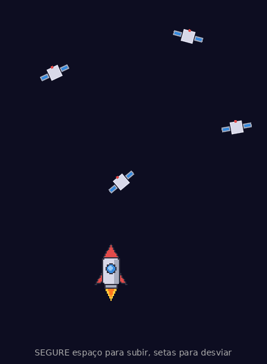

# Desafio: Campo de Satélites



Seu objetivo é construir este jogo: um foguete que sobe enquanto você segura a barra de espaço, se move para os lados com as setas, e explode se encostar em um satélite.

Você já construiu o Flappy Bird em aula. Este desafio usa os mesmos conceitos, com uma diferença importante: no Flappy os obstáculos vinham da direita para a esquerda; aqui eles caem de cima para baixo. **Consulte o seu código do Flappy o tempo todo.** Copiar do colega não vale; consultar o próprio código é a habilidade que estamos treinando.

Faça um passo de cada vez. Depois de cada passo tem um TESTE: só avance quando ele funcionar.

---

## Passo 1. Criar o projeto

Abra o terminal na pasta onde você guarda seus projetos e rode um comando de cada vez:

```bash
npm create vite@latest foguete -- --template vanilla
cd foguete
npm install
npm install phaser
npm run dev
```

Abra o endereço que aparecer no terminal (normalmente http://localhost:5173).

**TESTE:** aparece a página de demonstração do Vite (o logo e um botão contador).

---

## Passo 2. Limpar o template

Todo template vem com um exemplo pronto. O primeiro trabalho de um desenvolvedor é apagar o que não vai usar.

1. Apague os arquivos `counter.js` e `javascript.svg`
2. Abra o `style.css`, apague tudo e cole:

```css
body {
  margin: 0;
  display: flex;
  justify-content: center;
  align-items: center;
  min-height: 100vh;
  background: #1a1a2e;
}
```

3. Abra o `main.js`, apague tudo e monte o esqueleto que você já conhece: o `import` do CSS, o `import` do Phaser, uma classe de cena com um `create()` mostrando um texto qualquer, e o `new Phaser.Game` com a configuração (tamanho 440 por 600).

Escolha você mesmo a cor de fundo do jogo. É espaço: pode ser bem escuro.

**TESTE:** seu texto aparece na sua cor de fundo.

---

## Passo 3. Colocar o foguete na tela

Pegue o arquivo `assets/foguete.png` deste repositório e coloque em `public/assets/` dentro do seu projeto.

Essa imagem tem 192 por 96 pixels e contém **3 quadros de animação** lado a lado, cada um com 64 por 96. O quadro 0 é o foguete parado, os quadros 1 e 2 são o foguete com a chama acesa.

No `preload()` da sua cena, carregue esse arquivo como spritesheet. Você fez exatamente isso com o pássaro do Flappy: procure lá e adapte. Lembre de informar o tamanho de cada quadro.

No `create()`, coloque o foguete na tela com `this.add.sprite`. Por enquanto sem física.

**TESTE:** o foguete aparece parado no meio da tela.

**Se aparecer um quadrado no lugar do foguete:** a imagem não foi encontrada. Abra o console do navegador com F12 e leia o erro. Confira o caminho e o nome do arquivo, letra por letra.

---

## Passo 4. Ligar a gravidade

Antes de digitar qualquer coisa, escreva no caderno: *o que vai acontecer com o foguete quando eu ligar a física?*

Agora ligue, igual você fez no Flappy. Foram duas mudanças:

- uma no objeto de configuração, lá embaixo
- uma na linha que cria o foguete

Encontre as duas no seu Flappy. Escolha um valor de gravidade que faça sentido para um foguete pesado.

**TESTE:** o foguete despenca e some pela parte de baixo. Sua previsão estava certa?

---

## Passo 5. Criar o chão

Existe uma linha, que você já usou no Flappy, que impede um corpo com física de sair dos limites da tela. Encontre e use.

**TESTE:** o foguete cai e para no chão da tela, esperando o lançamento.

---

## Passo 6. O motor

Aqui está a diferença principal em relação ao Flappy.

No Flappy, o pássaro reagia ao **apertar** a tecla: um empurrão único, e pronto. O foguete é diferente: o motor precisa ficar ligado **enquanto** a tecla estiver pressionada, e desligar quando soltar. Ou seja, precisamos saber duas coisas: quando aperta e quando **solta**.

Você já conhece o evento `keydown-SPACE` (apertou). Existe o irmão dele:

```js
this.input.keyboard.on('keyup-SPACE', () => { ... });   // soltou
```

Com isso, monte a lógica. São três peças, e você escreve as três:

1. **A chave do motor.** No `create()`, crie uma variável da cena chamada `motorLigado`, começando em `false`. Lembre do `this.`
2. **Os interruptores.** Apertar espaço liga a chave (`true`). Soltar desliga (`false`).
3. **O motor.** Quem age é o `update()`, que roda 60 vezes por segundo. A cada frame, pergunte: a chave está ligada? Se estiver, aplique velocidade para CIMA no foguete. Você sabe qual método faz isso e sabe qual é o sinal do número (lembra da régua da tela?). Se a chave estiver desligada, não faça nada: a gravidade cuida da queda sozinha.

Antes de testar, escreva no caderno: *se eu segurar espaço para sempre, o que acontece quando o foguete chegar no teto?*

**TESTE:** segurou, sobe. Soltou, cai.

**Se o foguete sobe mas nunca mais desce:** você esqueceu um dos interruptores. Qual?

---

## Passo 7. A chama do motor

Agora que o motor liga e desliga, o foguete precisa mostrar isso.

Crie uma animação chamada `propulsao` usando **apenas os quadros 1 e 2** do spritesheet (os que têm chama). Você criou uma animação no Flappy para o pássaro bater asas: consulte e adapte.

Depois, ligue a animação aos interruptores:

- ao ligar o motor: `this.foguete.play('propulsao')`
- ao desligar: `this.foguete.stop()` e depois `this.foguete.setFrame(0)` para voltar ao quadro sem chama

**TESTE:** a chama acende quando você segura espaço e apaga quando solta.

**Se a chama continuar acesa depois de soltar:** faltou o `setFrame(0)`. Sem ele, a animação para, mas congela no quadro em que estava.

---

## Passo 8. Mover para os lados

Até agora usamos eventos: o teclado nos **avisa** quando algo acontece. Para as setas existe um jeito mais direto: **perguntar** a cada frame se a tecla está pressionada.

No final do `create()`:

```js
this.teclas = this.input.keyboard.createCursorKeys();
```

Isso te dá as quatro setas prontas: `this.teclas.left`, `right`, `up` e `down`. Cada uma tem a propriedade `isDown`, que vale `true` enquanto a tecla estiver pressionada.

No `update()`, monte a lógica: se a seta esquerda está pressionada, velocidade X negativa; se a direita, positiva; se nenhuma das duas, velocidade X igual a zero.

Depois de testar, responda no caderno:

1. Por que é necessário zerar a velocidade quando nenhuma seta está pressionada? Apague essa parte e veja o que acontece.
2. Por que a esquerda usa número negativo?

**TESTE:** o foguete sobe com espaço e se move para os lados com as setas, tudo ao mesmo tempo.

---

## Passo 9. Desenhar o satélite

O satélite não precisa de imagem: vamos desenhar por código, como você fez com o cano do Flappy.

No `create()`, use um `Graphics` para desenhar as formas e depois `generateTexture('satelite', largura, altura)` para transformar o desenho em textura. Não esqueça de destruir o Graphics no final.

Sugestão de formato: um quadrado no meio (o corpo) e dois retângulos finos nas laterais (os painéis solares). Tamanho aproximado: 50 por 24.

**TESTE:** nada muda na tela ainda. A textura só entrou no estoque, ninguém foi colocado em cena.

---

## Passo 10. Fazer os satélites caírem

Duas coisas no `create()`, ambas copiadas da estrutura do seu Flappy (só trocando os nomes):

1. Um grupo de física chamado `this.satelites`
2. Um timer que chama `this.criarSatelite()` a cada 1200 milissegundos

Depois, crie o método `criarSatelite()` na classe (irmão do `update()`). Dentro dele:

- sorteie a posição **horizontal** com `Phaser.Math.Between(40, 400)`
- crie o satélite no grupo, nascendo **acima** da tela (y negativo, tipo -30)
- desligue a gravidade dele com `satelite.body.setAllowGravity(false)`
- dê velocidade Y positiva para ele descer

Compare com o `criarParDeCanos()` do Flappy e responda no caderno:

1. Lá sorteávamos a posição vertical e fixávamos a horizontal. Aqui é o contrário. Por quê?
2. Por que a velocidade agora é positiva, e no Flappy era negativa?

**TESTE:** satélites descendo em posições sorteadas. O foguete atravessa eles como fantasma.

---

## Passo 11. Limpar o lixo

Os satélites que saem pela parte de baixo continuam existindo para sempre, consumindo memória. No Flappy você resolveu isso com uma linha dentro do `update()`.

Faça o mesmo aqui, trocando o eixo: percorra o grupo e destrua todo satélite cujo `y` já passou de 640.

**TESTE:** nada muda visualmente. Mas o jogo não vai ficar lento depois de alguns minutos.

---

## Passo 12. A explosão

Agora a colisão. É uma única linha no `create()`, igual à do Flappy, ligando o foguete ao grupo de satélites e chamando um método `explodir()`.

Depois crie o método `explodir()`, que deve:

1. Ter, na primeira linha, uma trava para não explodir duas vezes seguidas (você fez isso no Flappy: `if (this.acabou) return;`)
2. Marcar `this.acabou = true`
3. Pausar a física
4. Pintar o foguete de vermelho
5. Mostrar um texto de fim de jogo no meio da tela

Não esqueça dos dois guardas que aprendemos:

- `if (this.acabou) return;` na primeira linha do `update()`
- no método que liga o motor, se o jogo acabou, chamar `this.scene.restart()` e sair

**TESTE FINAL:** o foguete sobe, desvia dos satélites, explode ao encostar em um, e o clique recomeça o jogo.

---

## Está pronto quando

- [ ] O projeto foi criado do zero por você e roda com `npm run dev`
- [ ] O foguete aparece e cai com gravidade
- [ ] Segurar espaço faz subir, soltar faz cair
- [ ] A chama acende e apaga junto com o motor
- [ ] As setas movem o foguete para os lados
- [ ] Satélites caem em posições sorteadas
- [ ] Encostar em um satélite explode e mostra o fim de jogo
- [ ] Clicar reinicia

## Desafios extras

Terminou? Escolha um:

1. Faça os satélites girarem enquanto caem. Procure na documentação o que faz `setAngularVelocity`.
2. Sorteie também a velocidade de queda de cada satélite, entre 100 e 250.
3. Adicione um placar que conta quantos segundos você sobreviveu.
4. Faça o jogo ficar mais difícil com o tempo: a cada 10 segundos, os satélites caem mais rápido.
5. Desenhe seu próprio foguete e substitua o `foguete.png` (mantenha 3 quadros de 64 por 96, imagem total de 192 por 96).

## Referências

- [Documentação do Phaser](https://docs.phaser.io)
- [Exemplos de código](https://phaser.io/examples)
